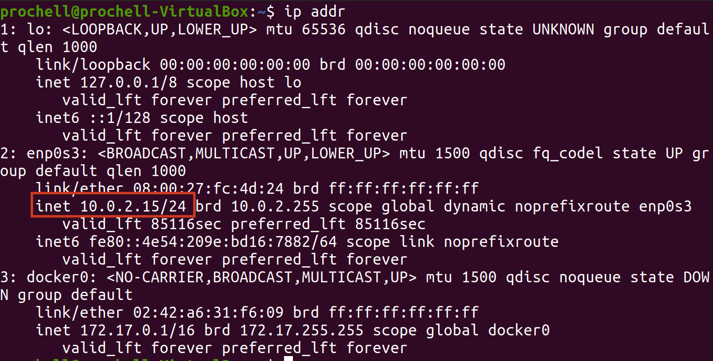
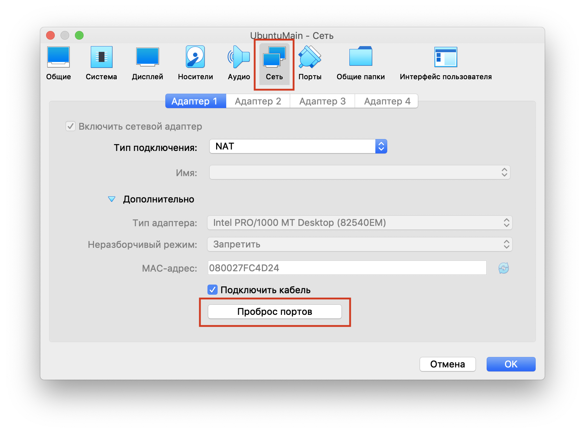
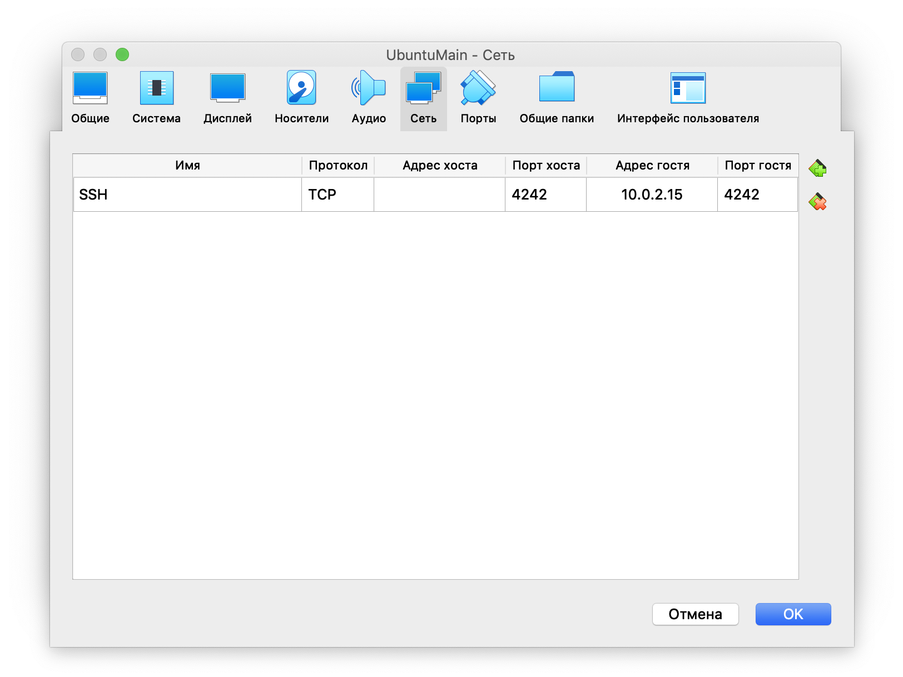

# Inception

1. #### Создание виртуальной машины

Образ [Ubuntu stable](https://releases.ubuntu.com/20.04/) и его [настройка](https://losst.ru/kak-polzovatsya-virtualbox#2_%D0%A1%D0%BE%D0%B7%D0%B4%D0%B0%D0%BD%D0%B8%D0%B5_%D0%B2%D0%B8%D1%80%D1%82%D1%83%D0%B0%D0%BB%D1%8C%D0%BD%D0%BE%D0%B9_%D0%BC%D0%B0%D1%88%D0%B8%D0%BD%D1%8B) через VirtualBox.
Рекомендую настраивать разрешение через саму систему, а не через scale VB.

2. #### Устновка необходимых программ

Например, vim и make

	$ sudo apt-get install vim
	$ sudo apt-get install make

3. #### (Опционально) Подключаем SSH

В первую очередь проверить, установлени и запущени ли ssh на виртуальной машине:
`sudo systemctl status ssh`, если нет устанавливаем

	$ sudo apt-get update
	$ sudo apt install openssh-server

В файле `/etc/ssh/sshd_config` ищем строку `#Port 22`, раскомментируем и меняем,
например, на `Port 4242`

Узнаем ip виртуальной машины и порт (обычно 10.0.2.15 и порт 22) командой `ip addr`

Заходим в настройки виртуальной машины
Сеть -> Проброс портов и создаем новое соединение как на картинке
 

Перезапускаем сервис: `$ sudo service ssh restart`

Подключаемся через терминал с локальной машины: `$ ssh your_username@localhost -p 4242`

Для подключения **Visual Studio Code** к виртуальной машине запустите виртуальную машину. Откройте Visual Studio Code на основной ОС. Слева на панели VS Code выберите Extensions (Расширения) и найдите и скачайте расширение "Remote - SSH". Затем в VS Code откройте меню с помощью сочетания клавиш Command+Shift+P, введите "Remote-SSH: Connect to Host..." и нажмите Enter. Там же введите <your_login>@localhost:<your_port>, затем введите пароль пользователя виртуальной машины, откройте необходимую папку через Explorer->Open Folder слева на панели VS Code, снова введите пароль пользователя виртуальной машины и создайте новый терминал

[Подробнее](https://comp-security.net/%D0%BF%D0%BE%D0%B4%D0%BA%D0%BB%D1%8E%D1%87%D0%B8%D1%82%D1%8C%D1%81%D1%8F-%D0%BA-%D0%B2%D0%B8%D1%80%D1%82%D1%83%D0%B0%D0%BB%D1%8C%D0%BD%D0%BE%D0%B9-%D0%BC%D0%B0%D1%88%D0%B8%D0%BD%D0%B5-%D0%BF%D0%BE-ssh/)

4. #### Изменяем хосты

Открываем с правами админа /etc/hosts и меняем localhost на 'username'.42.fr

	example: sudo vim /etc/hosts

5. #### Установка [Docker](https://www.digitalocean.com/community/tutorials/how-to-install-and-use-docker-compose-on-ubuntu-20-04-ru)

Достаточно первого шага.

6. #### Установка [Docker Compose](https://www.digitalocean.com/community/tutorials/how-to-install-and-use-docker-compose-on-ubuntu-20-04-ru)

7. #### Создаем Makefile

Для удобства [делаем](./Makefile) запуск, остановку и очистку всего.

8. #### [docker-compose.yml](./srcs/docker-compose.yml)

В директории __srcs__ создаем docker-compose.yml

Хороший [разбор](https://youtu.be/xuO8zv62HXM?list=PL0lO_mIqDDFX1c0JHogP5YuZdOVawoepS)

Создаем необходимые директории

	mkdir -p /home/${USER}/data/db
	mkdir -p /home/${USER}/data/wp

9. #### Настраиваем блок с nginx

Офицальныая [дока](https://hub.docker.com/_/nginx) с докерхаба

---

### Полезные ссылки

- [Правильный запуск процессов в контейнере с PID 1](https://it-lux.ru/docker-entrypoint-pid-1/)
- [Docker docks](https://docs.docker.com/)
- Полезная [статья](https://habr.com/ru/company/ruvds/blog/450312/) по docker compose на хабре
- [Роли пользователей WordPress](https://hostenko.com/wpcafe/tutorials/roli-polzovateley-wordpress-razbiraemsya-kto-est-kto/#:~:text=%D0%92%20WordPress%20%D0%B5%D1%81%D1%82%D1%8C%20%D1%80%D0%B0%D0%B7%D0%BD%D1%8B%D0%B5%20%D1%82%D0%B8%D0%BF%D1%8B,%D1%82%D0%BE%D0%B3%D0%BE%2C%20%D1%87%D1%82%D0%BE%20%D0%BF%D0%BE%D0%BB%D1%8C%D0%B7%D0%BE%D0%B2%D0%B0%D1%82%D0%B5%D0%BB%D1%8E%20%D1%80%D0%B0%D0%B7%D1%80%D0%B5%D1%88%D0%B5%D0%BD%D0%BE%20%D0%B4%D0%B5%D0%BB%D0%B0%D1%82%D1%8C.)
- freeCodeCamp [Docker](https://www.freecodecamp.org/news/docker-simplified-96639a35ff36/)
- Гоша Дударь [плейлист по докеру](https://www.youtube.com/playlist?list=PL0lO_mIqDDFX1c0JHogP5YuZdOVawoepS)
- Разные настройки, включая SSH на примере проекта [Born2BeRoot](https://baigal.medium.com/born2beroot-e6e26dfb50ac)
- [Статья](https://habr.com/ru/company/otus/blog/337688/) по продвинутой настройке docker-compose
